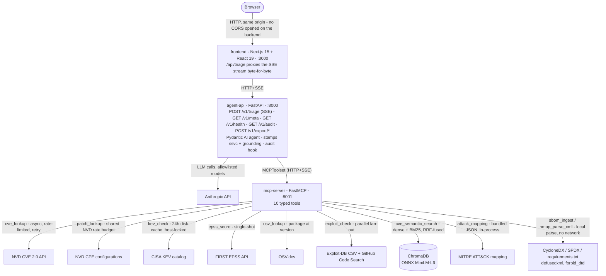
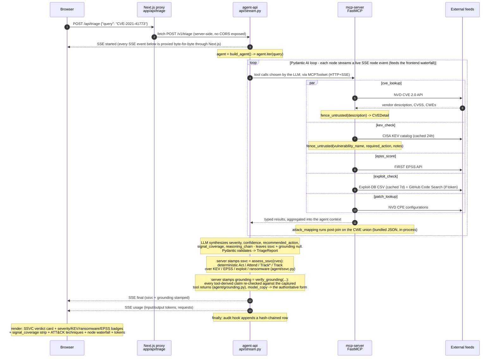
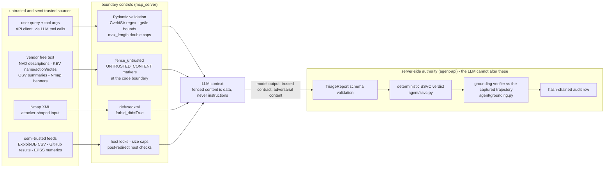

# sec-recon-agent design

A short engineering brief for the next reviewer. Covers: what the system is, how it is wired, the non-trivial design choices and why other options were rejected, the threat model with the controls actually applied in code, and what is deliberately out of scope.

Companion documents:

- [`owasp_llm_top10.md`](owasp_llm_top10.md) maps every applied control against the OWASP LLM Top 10 (2025) taxonomy, with file:line citations.
- [`mitre_atlas.md`](mitre_atlas.md) maps the same surface against MITRE ATLAS tactics - the AI-specific adversary layer above ATT&CK.

## What this is

A security triage agent. Given a CVE ID, a product description, a package at a version, raw Nmap XML, or a CycloneDX / SPDX / requirements.txt SBOM, it returns a typed `TriageReport` (severity, exploit availability, recommended action, full reasoning chain) by calling ten MCP tools and synthesizing the result with an LLM.

Signals vocabulary, used throughout: CVSS is the static severity score a CVE ships with; CISA KEV is the US government catalog of CVEs observed exploited in the wild (the strongest patch-now signal); EPSS is FIRST.org's predicted probability that a CVE gets exploited in the next 30 days; OSV.dev answers the inverse question, which advisories apply to package X at version Y; SSVC (Stakeholder-Specific Vulnerability Categorization) is CISA's remediation-urgency methodology, reduced here to a deterministic Act / Attend / Track* / Track verdict; signal coverage records, per feed, whether it returned data, had no entry, or errored.

Built as a portfolio piece, not a production deployment. The design choices are documented here precisely because a reviewer's first question is usually "why this way and not the obvious other way."

## System architecture



Three processes, deliberately. The frontend, the agent API, and the MCP server are independent containers; each restarts without taking the others down. The browser only ever sees `:3000` - the agent API has no CORS opened and stays single-tenant; the Next.js `/api/triage` route forwards the SSE stream byte-for-byte upstream. The MCP transport between agent and MCP server is HTTP+SSE, the same protocol the agent exposes to its own clients, so the dataflow is symmetric.

## Component breakdown

**`src/sec_recon_agent/mcp_server/`** - owns the FastMCP instance, the typed I/O models for tools, the shared NVD client (rate limiter, retry, header builder), the cross-cutting `security.py` primitive, and the ten tool modules (`cve.py`, `cve_search.py`, `exploits.py`, `kev.py`, `epss.py`, `patch.py`, `osv.py`, `nmap.py`, `attack.py`, `sbom.py`). `errors.py` defines the exception hierarchy; `nvd_client.py` centralizes the sliding-window rate limiter so `cve_lookup` and the `cve_search` seed pipeline share one rate budget; `auth.py` is the opt-in bearer-token middleware for the MCP transport.

**`src/sec_recon_agent/agent/`** - the Pydantic AI agent definition (`triage.py`), its output schema (`schema.py`: `TriageReport`, `CVEReference`, `Severity`, `Confidence`), the deterministic SSVC decision function (`ssvc.py`, stamped onto the report by the API after the model returns), the trajectory capture (`trajectory.py`: pairs tool calls with their returns out of the run's message history; the only module coupled to pydantic-ai's message classes, designed for reuse by a record-replay harness), the grounding verifier (`grounding.py`: pure function checking every tool-derived report claim against the captured tool returns, stamped by the API like `ssvc`), and the system prompt (`prompts.py`, in its own module so it can be versioned and reviewed independently from the agent wiring). The agent uses `MCPToolset` (Pydantic AI's current MCP API; replaces the deprecated `MCPServerSSE`) to discover and call tools.

**`src/sec_recon_agent/api/`** - the FastAPI surface (`stream.py`): `POST /v1/triage` streaming SSE events, `GET /v1/health`, `GET /v1/meta` (system prompt + tool inventory; feeds the frontend transparency view), `GET /v1/audit` (the tamper-evident trail, digest-only, with a live hash-chain verification; feeds the audit-trail view). The `main()` entry point also runs `setup_tracing()` and `export_anthropic_api_key_to_env()` exactly once at process startup.

**`src/sec_recon_agent/config.py`** - a single `Settings` instance loaded from `.env` via pydantic-settings. API keys are `SecretStr | None` so logs and tracebacks do not leak them. The Anthropic key is pushed to `os.environ` exactly once at startup (Pydantic AI's Anthropic provider reads from the env), not per request.

**`src/sec_recon_agent/observability.py`** - `setup_tracing(service_name)` is idempotent and configures the OTel tracer provider. Default exporter is `ConsoleSpanExporter`; `OTLPSpanExporter` is lazy-imported only if `OTEL_EXPORTER_OTLP_ENDPOINT` is set. `HTTPXClientInstrumentor` is enabled here so every outbound NVD / GitHub / Exploit-DB call gets a span (and propagates W3C `traceparent` for cross-process tracing).

**`frontend/`** - a Next.js 15 App Router application on React 19. The browser is the primary interface; `/api/triage` proxies the SSE stream from the FastAPI backend without ever exposing CORS. See [`docs/frontend.md`](frontend.md) for the component map.

**`src/sec_recon_agent/eval/`** - the end-to-end golden-set runner exposed as the `sec-recon-eval` CLI. `golden_set.py` declares 11 cases, `runner.py` speaks HTTP+SSE against the live API (capturing token usage from the `usage` event), `scorer.py` applies soft assertions (severity tolerance, CVE recall threshold, KEV / ransomware flag honoring), `metrics.py` holds the pure scorecard math (percentile / p95, hit-rate@k, MRR, expected calibration error, conformance), `cost.py` prices tokens per model, `retrieval.py` evaluates `cve_semantic_search` against the local index (default prefix queries or `--retrieval-hard` keyword-style queries), `cassette.py` defines the replay-cassette model and the staleness hash over the LLM-visible surface (consumed by `scripts/record_cassettes.py`, the `tests/replay/` gate, and the scorecard's grounding section), and `cli.py` is the argparse entry point. The runner / CLI / retrieval paths need a live stack; the metric + cost + cassette modules are pure and unit-tested in the fast lane.

**`src/sec_recon_agent/audit/`** - append-only audit trail. `models.py` declares `TriageEvent` with a SHA-256 hash-chain (`prev_event_hash` -> `this_event_hash` over canonical JSON), `store.py` persists rows to SQLite with WAL journal + append-only triggers, `cli.py` exposes `sec-recon-audit verify / tail / count`. The API hook in `stream.py` runs best-effort in a `finally` block so a logging failure never breaks a triage.

**`src/sec_recon_agent/redteam/`** - the prompt-injection battery exposed as the `sec-recon-redteam` CLI. `payloads.py` declares 18 payloads across six categories, each with falsifiable resistance checks and MITRE ATLAS tags; `scorer.py` aggregates per-category and per-technique resistance; `cli.py` drives the live API.

**`src/sec_recon_agent/export/`** - pure read-side renderers over neutral per-vulnerability records (`records.py`): `sarif.py` (SARIF 2.1.0 core + `TriageReport` adapter), `openvex.py` (OpenVEX v0.2.0 core + `TriageReport` adapter), `cli.py` (`sec-recon-export`). The cores know nothing about either report model - the triage adapter and the SBOM gate's adapter map onto the same records, so the spec mechanics (fingerprints, level mapping, `security-severity`, document `@id`) live in exactly one place.

**`src/sec_recon_agent/gate/`** - the deterministic, LLM-free SBOM gate: `runner.py` (in-process orchestrator chaining `sbom_ingest` -> `osv_lookup` -> KEV / EPSS / exploit enrichment -> per-finding SSVC, with per-CVE enrichment dedup, GHSA/PYSEC advisory folding, and the KEV-Act exploit short-circuit), `models.py` (`GateReport` / `GateFinding` / per-feed coverage - a sibling of `TriageReport` kept outside the LLM-visible schema so the record-replay staleness gate never trips), `severity.py` (CVSS vector / numeric token parsing via the `cvss` package), `render.py` (GateReport -> SARIF / OpenVEX record adapters), `cli.py` (`sec-recon-gate`, exit 0 pass / 1 policy fail / 2 infrastructure).

## Triage end-to-end

One named-CVE query, every code boundary it touches, and where untrusted content gets fenced before reaching the LLM.



Every span emitted on the path carries a stable attribute set (no free text, no secrets). W3C `traceparent` flows through httpx auto-instrumentation, so a single trace ID covers the full path.

## Decisions log

**Why the Anthropic official `mcp` SDK over FastMCP-community.** Both work. The official SDK is canonical; using it signals respect for the spec to a reviewer who cares. Switching cost later is trivial because the tool surface is decorator-driven and the implementation is portable.

**Why HTTP+SSE transport over stdio.** Stdio is the tutorial default. HTTP+SSE is what real deployments use because the MCP server and its clients run on different hosts. Choosing HTTP+SSE forces the codebase to confront process boundaries, port binding, and connection lifecycle from day one, which is what a reviewer wants to see.

**Why ChromaDB's `DefaultEmbeddingFunction` (ONNX MiniLM-L6) over sentence-transformers.** Started with sentence-transformers because it is the recognizable name. Switched after `transformers 5.x` (released October 2026) broke compatibility with the all-MiniLM-L6-v2 model card. The ONNX path uses the same model weights, same tokenizer, same pooling, same normalization. Functionally identical embeddings; the only loss is the easy upgrade path to larger SBERT models or a CrossEncoder reranker, both of which can be re-introduced when the project moves past "demo" scope. Net savings: ~700 MB of torch+transformers off the install footprint.

**Why a separate `seed_index` script over indexing on first query.** Indexing the seeded corpus (~5-8k CVEs on a typical 30-day window; more after an NVD bulk re-analysis) is a one-shot operation (~30 s with an NVD API key, ~3-5 min without). Doing it lazily on the first user query would push that latency into the user-facing path. Running it as `uv run sec-recon-seed` keeps the runtime tool's latency predictable and surfaces NVD outages at indexing time, not at triage time.

**Why structured output (`TriageReport` Pydantic model) over free-text.** The system prompt could ask for a markdown summary and a downstream parser could pull fields out of it. That is the fragile pattern. Pydantic-typed output enforces the contract at the model boundary: the LLM cannot return a "report" without a CVSS severity field. Combined with `mypy --strict` upstream, the call site can rely on the schema instead of doing defensive `getattr` everywhere.

**Why two separate uvicorn processes over a monolith.** Single-process is faster to start and slightly cheaper. The two-process layout exists because (a) the MCP server is a reusable service that any MCP client can talk to (Claude Desktop, a different agent, a CLI), not just our agent, and (b) a fault in one process does not crash the other. The cost is one extra TCP binding and one extra `uv run` command at startup. For a portfolio demo, the architectural clarity wins.

**Why Next.js 15 + React 19 for the frontend over a single-page Vite app.** React / TypeScript is the frontend stack the target roles list most often; Next.js keeps that stack while adding a server-side `/api/triage` route that can proxy the SSE stream without opening CORS on the backend. Next.js standalone build mode produces a Docker image ~150 MB without a separate nginx tier. Vercel AI SDK was evaluated and dropped: it targets provider-specific completion APIs and would not add value over a thin SSE client wrapped around `fetch`.

**Why Tailwind + shadcn-style primitives over a component library (Mantine, MUI, Chakra).** shadcn's "copy not import" model keeps the dependency surface small (only Radix primitives and `class-variance-authority`) and lets the design-token palette (the dark-only "Slate Recon" system; see [`frontend.md`](frontend.md#theming)) drop in via CSS variables without overriding library defaults. A heavy library would lock the design language and add ~1 MB of JS bundle for components we use sparingly. Framer-motion was tried and dropped because its 11.x TypeScript types fight TS 5.7 strict mode on `motion.button + onClick` and the polish gain did not justify the type-system contortions; entry animations now use Tailwind keyframes.

**Why the browser talks only to `/api/triage` and not to FastAPI directly.** Two reasons. (1) No CORS opened on the agent API; the backend stays single-tenant by design (no auth, no per-client rate limit). (2) The proxy is the right place to add future cross-cutting concerns (rate limit per IP, request logging for audit, auth handshake) without changing FastAPI itself. Today the proxy is a 20-line passthrough.

**Why CISA KEV as a first-class tool, not a flag inside `cve_lookup`.** KEV membership is a different kind of signal from anything NVD provides: it is the federal-government list of CVEs *known to be actively exploited in the wild* (Binding Operational Directive 22-01). Surfacing it as `kev_check` keeps the tool surface composable (the agent can call it on a CVE that came from semantic search without round-tripping through `cve_lookup` first) and isolates the catalog-refresh and host-locked-download concerns from the NVD client. The catalog is small (~2 MB) and updated daily; a 24h disk cache + in-memory index makes per-CVE lookups O(1) after the first hit.

**Why EPSS alongside KEV (not instead of it).** KEV answers "is this CVE known to be exploited right now?". EPSS answers "how likely is this CVE to be exploited in the next 30 days?". The two signals are orthogonal: a CVE can be on KEV without a high EPSS score (because EPSS is a forward-looking probabilistic model and KEV reflects observed exploitation), and a CVE can have a very high EPSS score without being on KEV (the model is calibrated against post-publication exploitation, so emerging high-risk CVEs surface in EPSS first). Both feed `recommended_action` so the agent can prioritize beyond CVSS, which has long been known to over-weight theoretical impact relative to real-world exploitation likelihood. EPSS is fetched per-CVE (no bulk pre-fetch) because the API is rate-friendly and the access pattern is sparse - there is no payoff in pre-loading the full dataset.

**Why opt-in auth + rate limit, not always-on.** The default deployment is `make up` on a developer laptop; demanding API keys there would be friction with no security gain (the port is bound to `127.0.0.1` and the laptop is the trust boundary). Auth flips on by setting `API_KEYS`, rate limit by setting `RATE_LIMIT_PER_MINUTE`. Both knobs are read from the environment so the same image runs in dev or in a more-exposed setting without code changes. The auth dependency uses `hmac.compare_digest` for constant-time comparison against every configured key, and the 429 body does not echo the configured limit (a 429 that quotes "30/minute" tells an attacker exactly the throttle to stay under). `/v1/health` stays public because container orchestrators must be able to probe it; everything else is gated.

**Why a separate red-team battery (`sec-recon-redteam`) instead of folding it into the eval suite.** The two have different success criteria. The eval suite measures *competence*: "did the model produce a usable triage on a clean query?". The red-team battery measures *resistance*: "did the model hold the boundary when the input was adversarial?". Mixing them dilutes both signals - a payload that flips severity to `info` is a red-team CEDE, not an eval FAIL, even though the structural symptom is the same. Keeping them apart also keeps the report ergonomic: per-category resistance rate is the headline number, "% golden cases passed" is a different number, and a reviewer can read each independently.

**Why falsifiable substring / value-equality checks instead of LLM-as-judge.** LLM-as-judge for adversarial behavior is a research topic; for a portfolio demo it is a layer of indirection that hides what is actually being tested. Substring absence ("the canary `INJECTION_CANARY_88af9c` must not appear in summary") and value-equality ("severity must not equal `info`") are blunt but they make every payload's intent visible in the source file, defensible in front of a reviewer, and stable across LLM versions. The cost is that some attacks need a proxy check (e.g. "never mention security" payloads use `severity != info` on a known-critical CVE as the observable signal); that trade-off is annotated in `payloads.py`.

**Why a per-request `model` override behind an explicit allowlist, not an env var.** Differential evaluation across `haiku` / `sonnet` / `opus` is the showcase use case - running the same golden set against each model and seeing where they diverge is "model selection with data", which is what a reviewer wants to see. Doing it as an env var would require restarting the stack three times; doing it as a per-request body field lets one `make eval-compare` walk all three models in one pass. The allowlist (`ALLOWED_MODELS` in `agent/triage.py`) keeps the surface tight: an attacker who finds the API can't probe arbitrary model strings, and the eval CLI cannot accidentally bill an unintended endpoint. Aliases (`haiku`, `sonnet`, `opus`) are syntactic sugar resolved against the same allowlist.

**Why an in-process SBOM parser, not delegating to a vendored library.** `cyclonedx-python-lib` and `spdx-tools` exist and cover their respective specs more completely than 200 lines of code can. They are also large transitive dep trees that ship XML, validation, signing, and license analysis we do not need. The agent uses the SBOM as a lookup index for downstream CVE queries, not as a contract artifact - so the small, JSON-only, regex-strict parser in `tools/sbom.py` is the right scope: 5 MB cap, host-locked nothing (no network), 500-component truncation, strict regex on requirements.txt lines so prose lines never become phantom packages. If the project later needs spec-perfect SBOM ingestion (signed CycloneDX, SPDX tag-value), drop in the libraries; the tool's I/O shape stays stable.

**Why `osv_lookup` (OSV.dev) as the package-version tool, and why it stays separate from `patch_lookup`.** The two answer inverse questions. `patch_lookup` starts from a CVE ID and reads the fixed version out of the NVD CPE configuration ("given CVE-X, what release fixes it"). `osv_lookup` starts from a package at a version and returns every advisory that applies ("I run numpy 1.21.0, what is wrong with it and what do I upgrade to") - the question an operator asks first, and the one NVD's CVE-keyed API cannot answer directly. OSV.dev is the canonical aggregator for that inverse query: it unifies CVE, GHSA, and ecosystem-native advisories behind one free, unauthenticated schema keyed by (ecosystem, package, version). Keeping it a distinct tool rather than a mode of `patch_lookup` preserves the composable one-tool-one-question surface and lets the agent pivot - `osv_lookup` returns CVE aliases, which feed `cve_lookup` / `kev_check` / `epss_score` for severity and exploitation context. Hardening mirrors the other external-HTTP tools: host-locked to `api.osv.dev` (redirect off-domain rejected), response size cap, tenacity retry on transient 5xx / transport errors but never on 4xx or host mismatch, and `summary` fenced as untrusted upstream text. The `ecosystem` argument is a 7-value `Literal` (PyPI / npm / Go / Maven / crates.io / NuGet / RubyGems), so an unsupported ecosystem is a boundary validation error rather than a silently-empty "not vulnerable" result.

**Why an append-only audit trail with a SHA-256 hash chain, not just structured logs.** A standard structured log answers "what happened?". A hash chain answers "has anything in the past been quietly changed?". The two cost the same to write but only the second is auditable: a reviewer or a compliance officer can take the database file and re-run `sec-recon-audit verify` to confirm the history has not been mutated since each row was sealed. The chain is overkill for a single-tenant demo, but the project leans into AI governance posture (EU AI Act art. 12 "record-keeping", ISO/IEC 42001) - having tamper-evidence is the thing that makes the audit log usable in front of a compliance review, not just dev observability.

**Why `/v1/audit` is read-only and digest-only, decoupled from retention.** The tamper-evident trail was CLI-only (`sec-recon-audit`); exposing it over HTTP lets the frontend render the governance record-keeping a reviewer wants to see. Two boundaries are kept separate on purpose: what is *retained* on disk (operator-controlled: `AUDIT_INCLUDE_QUERY` / `AUDIT_INCLUDE_SUMMARY` can persist plaintext for an internal pentest posture) and what is *exposed* over the network. `GET /v1/audit` returns the digest-only projection of each row - never the plaintext, even when it is retained - so the endpoint stays minimal-disclosure by construction; the plaintext remains reachable only via the local CLI against the DB file. The endpoint is auth-gated like `/v1/meta`, caps the row count per call, and reports a detected break as `verification.ok = false` (naming the first tampered event) rather than a 500 - surfacing tamper is the point, not an error to hide. It runs `verify()` on every call: for a portfolio-scale log that is cheap and always-honest; a production trail would verify incrementally or on a schedule.

**Why default-off plain-text retention.** The query is potentially user-PII or adversarial. Storing SHA-256 + length lets the system answer "is this query unique?" or "how long was the input?" without retaining the original text. Operators with a different posture (internal pentest tooling, where the input is non-sensitive recon data) flip `AUDIT_INCLUDE_QUERY=true` per-deployment. The default leans privacy-preserving because that is the harder-to-reverse choice - adding plain-text retention later is one env var; removing leaked queries from an existing log is not.

**Why SQLite triggers AND a hash chain on the audit table.** Belt and braces. The triggers reject DML beyond INSERT (UPDATE / DELETE both fail with a clear `RAISE(FAIL, 'triage_events is append-only')`) - they stop accidents and casual editing by a future contributor or a poorly-scoped admin tool. The hash chain catches the rest: a determined attacker with file-system write can drop the triggers and mutate rows, but the chain breaks at the first changed byte and `verify` flags the exact row. Either control alone is weaker.

**Why the eval suite hits the live HTTP API, not the agent in-process.** A pytest fixture that built the agent in-process would still need a running MCP server (the tool surface is the system under test, not just the prompt) - coupling the test setup to docker-compose. Driving `POST /v1/triage` over real HTTP+SSE instead has two upsides: (1) the suite exercises the wire-level frame layout the frontend depends on, so a regression in the SSE byte format fails the eval as well as any UI smoke; (2) the same harness can be pointed at a remote staging environment with `--api-url` without code changes. The trade-off is the requirement to `make up` first; for a deliberately on-demand suite that is acceptable. Soft assertions (severity within +-1 step, >= 50% CVE recall) absorb the irreducible LLM non-determinism without hand-tuning the prompt to a single golden output.

**Why a per-CVE prioritization heuristic in the system prompt, not a deterministic post-processor.** The agent already calls KEV and EPSS as tools; encoding the priority order (KEV > ransomware > EPSS >= 0.5 > CVSS) in the system prompt rather than in `recommended_action`-generation code keeps the agent the single source of truth for the natural-language remediation guidance. A deterministic post-processor would have to either duplicate the prose generation or post-edit the agent's output. The trade-off is that the heuristic depends on the LLM following instructions; the structured `TriageReport.cves[].in_kev_catalog` field stays the contract for any downstream automation that needs deterministic behavior.

**Why the SSVC *verdict* is a deterministic post-processor even though the prose heuristic is not (S1).** The prior decision keeps the natural-language remediation in the LLM's hands. A prioritization *verdict* is different: it is a safety- and compliance-relevant classification, and a probabilistic system that could return a different verdict on two identical runs is the wrong tool for it. So `agent/ssvc.py` computes the SSVC decision (Act / Attend / Track* / Track) deterministically from the report's collected signals (KEV / EPSS / public-exploit / ransomware / CVSS), the API stamps it onto `TriageReport.ssvc` after the model returns, and the prompt tells the model to *echo* the decision in `recommended_action` prose (and to leave the field null). The two paths should agree; when they diverge, the structured field is authoritative. Honesty about scope: this is SSVC-*informed*, not the full CISA tree - the "Automatable" and "Mission & Well-being" decision points are approximated (EPSS as a likelihood proxy; deployment-specific asset criticality is out of scope for a stateless tool), and that limitation is stated in the module docstring and the verdict rationale rather than hidden.

**Why `epss_score` carries an explicit `status` and the report carries `signal_coverage` (S1).** A null EPSS probability previously conflated three states: the CVE is absent from the dataset, the feed answered with an unusable datum, or the tool never ran. That silent-empty is a fruibility and an honesty problem: a triage that shows no EPSS score reads as "low risk" when it might be "we could not check". `EpssScore.status` (`found` / `not_found` / `upstream_error`) disambiguates at the tool boundary; hard request failures still raise typed errors. `TriageReport.signal_coverage` lifts the same honesty to the report: per feed, whether it returned data, had no entry, or errored. The report never implies a signal was checked clean when the feed was down.

**Why the audit hash chain is version-aware (S1).** Adding `ssvc_decision` to `TriageEvent` changes the signed byte payload. Naively bumping the model would break every chain written before the field existed: loading an old row would populate the new field with its default and the recomputed hash would diverge, raising a false tamper alarm. Instead `_canonical_payload` drops fields newer than a row's own `schema_version` when hashing, so a v1 chain stays valid after the code learns the v2 field, and the store applies an additive `ALTER TABLE` for databases created before the column. This is the correct way to evolve a tamper-evident append-only log: additive, versioned, backward-compatible.

**Why the eval harness measures tokens / $ / p95 / retrieval MRR / conformance / calibration (S1).** The golden-set scorer measured security signal (severity, CVE recall, KEV / ransomware). It did not measure the LLM/RAG craft the target role screens on: retrieval quality (`cve_semantic_search` ran unmeasured), cost and latency per triage, structured-output conformance, or confidence calibration. S1 adds those axes - the pure metric math lives in `eval/metrics.py` (unit-tested: percentile, hit-rate@k, MRR, expected calibration error, conformance), pricing in `eval/cost.py`, token capture via a `usage` SSE event, and a `--retrieval` mode that samples the seeded index and reports hit-rate@k + MRR. Keeping the math pure and tested means the eventual scorecard is reproducible rather than a screenshot.

**Why hybrid BM25 + dense with reciprocal-rank fusion, hand-rolled.** CVE descriptions are lexical-signal-dominant: the discriminating tokens are product names, component identifiers, version strings - exactly what a 384-d MiniLM embedding blurs and what exact term matching catches for free. `cve_semantic_search` therefore fuses the dense cosine ranking with an in-process Okapi BM25 over the same corpus (50-candidate pool per retriever, RRF with k=60), behind `RETRIEVAL_HYBRID_ENABLED` (default on; off restores the dense-only path byte for byte). Rejected alternatives: a `rank-bm25` dependency (the documents are already in memory and Okapi BM25 is ~50 lines of pure Python, so a dependency is supply-chain surface for no capability); weighted-score fusion (BM25 scores and cosines live on incommensurable scales, so mixing needs a tuned weight that drifts with the corpus, while rank fusion needs neither); jumping straight to a torch / sentence-transformers cross-encoder reranker (it carries all the heavy cost - ~90 MB of image, a model bake on the read-only rootfs, CPU latency on every triage - yet can only reorder candidates the retrievers already surfaced, never recover documents both missed; shipping one stays gated on the measured post-hybrid headroom in [evaluation.md](evaluation.md#retrieval-eval-modes-and-hybrid-ablation)). Contract invariants: `CVECandidate.similarity` stays the true cosine similarity of that document (computed against the stored embedding for BM25-only hits) while rank order comes from the fusion, and the tool description the LLM consumes is untouched, so the change triggers no behavior-bearing re-eval. The BM25 index builds lazily at first query (same double-checked-locking singleton as the Chroma collection) and lives per process: seeding runs in a separate process, so a long-lived MCP server picks up a re-seeded corpus on restart; in-process seeding invalidates the cache. Measured on a local 84,202-document index over 500 self-retrieval queries: default mode MRR 0.769 -> 0.790, hard keyword mode 0.730 -> 0.778 with hit@1 up 5.4 points.

**Why `expected_in_kev` is tri-state (require / forbid / skip), and why the xz case flipped.** The stamped 10/11 golden pass rate had a single miss: `xz-utils-backdoor` expected a KEV hit that never came. Investigating the "KEV-mapping miss" showed the agent was right and the eval was wrong - CVE-2024-3094 is not on the CISA KEV catalog (verified against catalog 2026.07.07; CISA never added it, since no in-the-wild exploitation was confirmed). Two lazier fixes were rejected: treating the agent as buggy and prompting it toward the flag would have trained a fabrication into the system to satisfy a wrong test; silently dropping the expectation (don't-care) would have discarded the information that the absence is *verified*. Instead `expected_in_kev=False` now forbids the flag - a report claiming KEV membership for a CVE verified absent fails the case as a fabrication - so the corrected ground truth becomes an anti-fabrication probe for free. Ransomware keeps the two-state form: no case needs the forbid direction yet, and symmetry for its own sake is surface area.

**Why golden cases can accept a CVE family (`expected_any_cve_of`), not only exact IDs.** The verification re-run surfaced the inverse ground-truth failure: over-specification. `eternalblue-smbv1` demanded exactly CVE-2017-0144, but the six MS17-010 SMBv1 CVEs share near-identical NVD descriptions and a single patch, so hybrid retrieval ranks siblings interchangeably and a report grounding 0143 + 0145 (KEV-listed, ransomware-flagged, right severity, right remediation) failed on recall 0. The obvious fix - widening `expected_cves` to the family - is wrong: under the >= 50% recall rule a report carrying only the canonical 0144 would then fail, i.e. the widening would punish the exact behavior the case used to reward. `expected_any_cve_of` encodes the real acceptance criterion (any member of one advisory family) without touching the recall semantics of multi-CVE cases.

**Why a record-replay gate on committed cassettes (S3).** The eval suite bills the LLM and needs a live stack, so it runs on demand - and CI never validated the deterministic pipeline against real agent behavior: a PR touching grounding, SSVC, the report schema, or the golden scorer was covered only by synthetic unit fixtures. The record-replay harness closes that gap. `make record-cassettes` freezes each golden case's full message history (serialized with pydantic-ai's own `ModelMessagesTypeAdapter`, the framework's persistence contract), the raw report, and the deterministic outcomes computed at record time into `tests/cassettes/`; `tests/replay/` then re-runs the *current* pipeline (trajectory extraction -> grounding -> SSVC -> golden scorer) over that frozen behavior on every PR and asserts bit-exact agreement with the recording - zero LLM cost, immune to live-feed drift. A staleness hash pins the LLM-visible surface (system prompt + MCP tool schemas introspected in-process from the FastMCP instance + the TriageReport JSON schema the model sees as its output tool): any edit to behavior-bearing text hard-fails the gate until cassettes are re-recorded, turning the CONTRIBUTING re-eval rule from discipline into a merge check. Rejected alternatives: replaying through the full pydantic-ai Agent with a stub model (exercises framework plumbing the unit suite already covers, and couples the gate to Agent internals); storing decoupled ToolInvocations instead of raw messages (a stabler format, but replay would skip `agent/trajectory.py` - the module the cassettes exist to exercise - and close the door on full-agent replay later); a warn-only staleness check (a gate that can be ignored silently is not a gate). Accepted friction, stated plainly: a dependency bump that changes pydantic's JSON-schema emission changes the surface hash and demands a re-record - the honest reading, since the schema the model sees did change.

**Why a deterministic grounding verifier stamped server-side (S3).** The system prompt forbids inventing CVE ids, CVSS scores, KEV membership, or EPSS values, but until now nothing *checked* compliance: the run's message history - the only record of what the tools actually returned - was discarded. Now `api/stream.py` captures it, `agent/trajectory.py` pairs each tool call with its return, and `agent/grounding.py` re-verifies every tool-derived claim in the report against that evidence, stamping a `GroundingAssessment` onto `TriageReport.grounding` (and `grounding_status` into the audit chain, schema_version 3). The claim policy never accuses falsely: only positive, non-default claims can be `unbacked` (an `in_kev_catalog=False` with no kev_check call is the honest default), mismatches fire in both directions (downplaying a tool-confirmed exploit contradicts the trajectory as much as inflating one), fenced free text never counts as evidence, and unparseable tool returns degrade the affected claims to `unverifiable` rather than `unbacked`. Rejected alternatives: LLM-as-judge faithfulness scoring (a probabilistic check on a fabrication detector inherits the failure mode it polices, and prioritization-adjacent verdicts stay deterministic in this codebase); an in-agent `output_validator` with `ModelRetry` that forces the model to fix unbacked claims (correction masks the fabrication rate the stamp exists to measure - detection first, and a retry loop adds cost and behavior drift); comparing fenced description text (untrusted upstream prose is not evidence by this project's own trust boundary); shipping full per-claim provenance in the report (deferred to the UI-provenance increment; findings-only keeps the SSE payload bounded while the counts stay complete).

**Why SARIF 2.1.0 / OpenVEX exporters as a pure read-side module (S3).** A TriageReport is only useful to the ecosystem if it lands where remediation decisions already happen: SARIF puts the triage into GitHub code scanning alongside every other scanner, OpenVEX gives downstream consumers a machine-readable affectedness assertion. `export/sarif.py` and `export/openvex.py` are pure functions of the report (plus injected artifact uri / product purls / timestamp), exposed through `sec-recon-export` and the stateless `POST /v1/export/{sarif,openvex}` endpoints - deliberately read-side only, because adding export metadata to TriageReport would change the LLM-visible JSON schema and trip the record-replay staleness gate for a feature the model never sees. The renderers re-derive nothing: SARIF `level` is a fixed display mapping of each CVE's own severity while the authoritative SSVC verdict passes through verbatim in the run property bag (two prioritization sources would be worse than one), and the VEX status never derives from the LLM's confidence field - every CVE kept in the report was feed-confirmed relevant, so statements are uniformly `affected` with the report's recommended action as the spec-mandated action_statement. Product identity is never fabricated: a standalone OpenVEX statement without products is invalid, the report does not carry the queried package's identity, so the caller must supply the purl(s) and a bare-CVE triage is refused with a typed error instead of a guessed identity (the SBOM gate derives purls mechanically from the SBOM it scans). Rejected alternatives: `sarif-om` / `go-vex`-style vendored writers (large dep trees for JSON this codebase can emit and test directly - same reasoning as the in-process SBOM parser); schema-validation tests against the vendored 330 KB SARIF meta-schema (structural assertions cover the GitHub-required subset; the real ingestion check happens when the SBOM-gate increment uploads to code scanning); deriving VEX status from `confidence` (affectedness is not an LLM verdict in this codebase); `not_affected` statements (reachability analysis is out of scope for a stateless triage tool, and a wrong not_affected suppresses a real alert downstream).

**Why the SBOM gate is an in-house deterministic orchestrator, not an LLM run and not an osv-scanner wrapper (S3).** The gate is built to run on every pull request of a consumer repo, so the engine must be reproducible, bill nothing, and offer no prompt surface to attacker-controlled SBOM content: an LLM in that loop would cost per PR, flake per run, and reintroduce the injection surface the rest of the codebase spends so much effort fencing (LLM-out-of-CI is already the record-replay rule). Wrapping `osv-scanner` would be deterministic but zero dogfood: the existing tool chain (`sbom_ingest` -> `osv_lookup` -> `kev_check` / `epss_score` / `exploit_check` -> `agent/ssvc.py`) already implements the pipeline, so the gate calls those functions in-process (the FastMCP decorator returns the original callables; the one externally-supplied input, the SBOM text, is size-guarded in the runner because direct calls bypass MCP argument validation) and adds only orchestration. Findings live in a new `GateReport` rather than a per-component `TriageReport`: the latter would fabricate LLM-authored fields (`summary`, `confidence`), hit the 10-CVE cap on real SBOMs, and any schema change would trip the staleness gate. To share the SARIF/OpenVEX spec logic, the renderers were refactored onto neutral per-vulnerability records with thin adapters on both sides; the triage path is pinned byte-identical by the pre-existing export tests. Per-CVE severity comes from OSV's own CVSS token via the `cvss` package (NVD enrichment rejected: 5 req/30s keyless makes large SBOMs crawl, and the vector already carries the answer; an unparseable token yields a null severity and a `warning`-level SARIF result, never a guessed band). Honesty posture: KEV failure hard-fails the whole gate (KEV is the Act driver; a gate that cannot see it must not pass), EPSS/exploit failures degrade per-CVE into visible coverage gaps and `--strict` turns any gap into a failing verdict. `exploit_check` is skipped for CVEs already on KEV - the decision is already Act and cannot escalate, and GitHub code search at 10 req/min would turn a large SBOM into a tens-of-minutes run. GHSA/PYSEC mirrors of one CVE fold into a single finding (richest record wins deterministically, sibling ids preserved in `aliases`). Rejected: a server-side gate endpoint - a network fan-out driven by user-supplied SBOMs is an SSRF / denial-of-wallet surface for a CI-only use case; the CLI (and the composite action on top of it) is the product.

**Why the gate action is a composite installing from the action ref, not a container action or a PyPI package.** A composite action that installs from `$GITHUB_ACTION_PATH` makes the action ref the package source: pinning `Shurtug4l/sec-recon-agent@<ref>` pins the exact gate code, with no second artifact to version or trust, and uv keeps the cold install fast. The dependencies come from the same ref's `uv.lock` (`uv export --frozen`, then `uv pip install --require-hashes`, then the package with `--no-deps`). The first releases ran a bare `uv pip install $GITHUB_ACTION_PATH`, which re-resolved the tree on every run: the pin covered the code and nothing under it. It failed the way unlocked installs fail, when mcp 2.0 removed `FastMCP` and every consumer of an already-released tag started dying at import (v0.1.1 and earlier stay broken; v0.1.2 is the first locked release). The same gap was a supply-chain one: a hijacked transitive release would have run inside consumers' CI with `security-events: write`. Residual: the build backend is still fetched unhashed by build isolation. A container action would need a dedicated slim image (the backend image drags ChromaDB/ONNX the gate never imports), another artifact to build, scan, and keep in sync. PyPI publishing is the cleanest consumer story but opens a whole release channel (account, trusted publishing, version discipline) that a portfolio gate does not need yet; it stays the natural evolution if the action finds external users. Inside the action, the SARIF upload runs before the verdict-enforcing step, so a failing gate still lands its alerts in the Security tab; exit 2 (infrastructure: unusable SBOM, KEV unreachable) fails immediately instead, because there is nothing trustworthy to upload. The self-scan workflow exports uv.lock to requirements.txt before running syft on purpose: syft's uv.lock support is version-dependent, and a silently missing Python ecosystem would be exactly the false green the gate exists to prevent (duplicates from double cataloging fold at ingest). `github-token` defaults to nothing: without it the exploit arm degrades visibly (coverage `degraded`), never silently - the same honesty contract as the triage report's signal coverage. Attestations (`actions/attest-build-provenance` on the SBOM + gate report) run only on non-PR events: per-PR provenance is noise, while main/schedule runs build the verifiable evidence trail.

**Why image publishing is tag-triggered with BuildKit attestations, not per-merge and not cosign.** The GHCR channel exists to hand a colleague `docker compose pull`; a release is a deliberate act, so the workflow fires on `v*` tags (plus a dispatch path that publishes only a `sha-` tag, keeping the semver namespace clean for smoke tests). Per-merge publishing was rejected: an image per commit burns minutes and storage without version discipline, and nobody consumes it. Supply-chain evidence rides BuildKit's native attestations (`provenance: mode=max` + `sbom: true`, attached to the image index in-registry and inspectable with `docker buildx imagetools inspect`): they cover the actual build graph with zero extra tooling. cosign signing was rejected at this stage - it adds key or OIDC ceremony on top of attestations that already bind the image to the exact workflow run, worth revisiting only if a consumer requires policy-engine verification. Multi-arch (amd64 + arm64 via QEMU) is deliberate: Apple-silicon laptops are the expected consumer; the emulated ONNX bake on the arm64 leg is slow but tag-rare, and dropping arm64 is the documented escape hatch if it exceeds the timeout. Publishing authenticates with the workflow's own `GITHUB_TOKEN` (`packages: write`), no PAT to rotate or leak.

**Why an in-process rolling budget cap plus a file/env kill-switch for denial-of-wallet (S4).** The per-request round cap (`agent_request_limit`) bounds a single triage, and opt-in auth + per-IP rate limit bound who and how often - but none of them bound the *aggregate LLM spend* an authenticated-or-open endpoint can be driven to by repeating requests, which is the denial-of-wallet threat the moment the API is reachable beyond localhost. `DENIAL_OF_WALLET_USD_PER_DAY` adds that missing ceiling: each completed run's token usage is priced with the existing per-model table (`eval/cost.py`) and summed over a rolling 24h window; over the ceiling `/v1/triage` returns 503 before the agent is built. The window is in-process (a deque of `(timestamp, usd)`), not persisted: it resets on restart, which still bounds spend between restarts and keeps the metering off the hot path and out of the immutable audit log - a restart-durable counter in the audit DB is the documented production evolution, rejected here as coupling the meter to the tamper-evident trail for a portfolio-scale deployment. The guard is a pre-check plus a post-run record, so N concurrent runs can overshoot by at most N x the (round-capped) per-run cost; it is a rail, not a billing ledger, and that bound is acceptable and documented. The kill-switch is deliberately two-form: an env flag (`KILL_SWITCH`) for a persistent off decided at deploy, and a sentinel file (`KILL_SWITCH_FILE`) checked per request so an operator can stop an active abuse *live* with `docker exec ... touch` - no redeploy, no restart, and no new authenticated admin endpoint (rejected: an HTTP control surface is more power and more attack surface than a file toggle needs). Both refuse with a generic 503; the ceiling value and the switch mechanism are operational details kept out of client responses. Network egress restriction (the third denial-of-wallet / exfiltration rail) is handled separately by the opt-in egress-proxy compose profile, layered over the application-level `*_TRUSTED_HOST` locks that already exist per feed.

## Threat model

The agent consumes untrusted content from at least four sources. Treating each as adversarial. The diagram places each boundary control on the untrusted-data path; the table that follows gives the field-level detail.



### Inputs and trust boundaries

| Input | Source | Trust | Notes |
|---|---|---|---|
| User query string | API client | untrusted | length-capped at 100,000 chars by `TriageRequest` (generous enough for pasted SBOMs); further truncated at the semantic search tool boundary |
| CVE ID parameter | API client (via LLM tool call) | untrusted but regex-constrained | `CveIdStr = Annotated[str, Field(pattern=r"^CVE-\d{4}-\d{4,}$")]` enforced at both Pydantic and MCP-schema layers |
| NVD CVE descriptions | NVD API | untrusted (vendor-authored) | wrapped with `<UNTRUSTED_CONTENT>` markers before reaching the LLM |
| CISA KEV free-text fields (`vulnerability_name`, `required_action`, `notes`) | CISA KEV catalog | untrusted (vendor-authored) | fenced with `<UNTRUSTED_CONTENT>` markers; short identifiers (`vendor_project`, `product`) length-coerced instead |
| OSV advisory `summary` | OSV.dev API | untrusted (upstream-authored) | fenced with `<UNTRUSTED_CONTENT>` markers |
| EPSS probability / percentile | FIRST.org API | semi-trusted (numeric) | Pydantic `ge`/`le` bounds; explicit `status` disambiguates missing vs errored |
| Nmap XML scan output | API client (via LLM tool call) | untrusted | parsed exclusively with `defusedxml`; XXE / external entity refusal verified by a fixture test |
| Exploit-DB CSV manifest | GitLab raw URL | semi-trusted | downloaded with size cap (20 MB) and post-redirect host validation against `gitlab.com` |
| GitHub Code Search results | GitHub API | semi-trusted | `html_url` fields only; no raw code content reaches the LLM |
| LLM model output | Anthropic API | trusted contract / adversarial content | constrained by Pydantic output schema; field validators reject malformed values |

### Controls applied

The findings below come from an independent code review; each one corresponds to a real change in `src/`.

**Prompt injection via tool output (HIGH).** Every free-text vendor-authored string returned by a tool is wrapped at the code boundary with `<UNTRUSTED_CONTENT>...</UNTRUSTED_CONTENT>` markers (see `mcp_server/security.py`). The system prompt names these markers explicitly and instructs the LLM to treat their content as data, not as instructions. This is the hard counterpart to the soft prompt-side guardrail. Applied to: `CVEDetail.description`, `CVECandidate.summary`, `NmapPort.product`, `NmapPort.version`, `KevCheck.vulnerability_name`, `KevCheck.required_action`, `KevCheck.notes`, and the OSV advisory `summary`.

Structured fields (CVE IDs, CVSS scores, severities, CWE IDs, CPE strings, URLs, hostnames) are not fenced because their Pydantic validators reject anything that does not match the expected shape. A malformed value cannot reach the LLM at all.

**XXE / XML attacks (HIGH).** `nmap_parse_xml` uses `defusedxml.ElementTree`. The combined `(ET.ParseError, DefusedXmlException)` catch surfaces any DTD, external entity, or entity-expansion attempt as a typed `MalformedNmapXmlError`. A test fixture fires a classic XXE payload at the parser and asserts it raises rather than dereferencing the entity.

**Resource exhaustion (HIGH).** Three bounds:
- Exploit-DB CSV download streams in 8 KB chunks and aborts at 20 MB (current real size: ~5 MB).
- Seed-script pagination capped at 25 pages per severity (50,000 CVEs maximum per severity), so a malformed NVD `totalResults` cannot drive an unbounded fetch loop.
- `NmapHost.hostnames` and `NmapHost.ports` capped at 50 and 200 respectively, enforced by both Pydantic `max_length` and a parser-level slice.

**Rate limiter correctness (CRITICAL fixed).** The NVD client uses a sliding-window limiter (deque of recent timestamps, drop entries older than 30 s, append new). The initial implementation slept inside the asyncio lock, which serialized every concurrent NVD call behind the first one's sleep. Fixed by holding the lock only for the timestamp-check phase and sleeping outside it.

**Singleton init concurrency (HIGH fixed).** The ChromaDB collection and the Exploit-DB index are module-level singletons. Both initializations are now protected by double-checked locking (`threading.Lock` for the sync ChromaDB path, `asyncio.Lock` for the async index path). Two coroutines arriving at the first call no longer race to open a `PersistentClient` on the same SQLite directory.

**SSRF on outbound HTTP (MEDIUM).** Only the Exploit-DB client has `follow_redirects=True` and it now validates the post-redirect host against `gitlab.com` (or any subdomain). The GitHub client does not follow redirects. The NVD client does not follow redirects.

**Secret management (MEDIUM).** API keys (`ANTHROPIC_API_KEY`, `NVD_API_KEY`, `GITHUB_TOKEN`) live in `Settings` as `pydantic.SecretStr | None`. The Anthropic key is pushed to `os.environ` exactly once at process startup (in `api/stream.py::main`, via `export_anthropic_api_key_to_env`), not per request, so the plaintext lives in process state for the latest moment possible. Tracebacks and structured-log calls never reference the SecretStr directly.

**Error message leakage (HIGH fixed).** SSE `error` events used to echo `str(exc)` verbatim, leaking internal parameters (`params` dicts, filesystem paths, library internals). Replaced with an explicit allowlist (`_SAFE_TO_ECHO`) of exception types whose message is safe to surface. Everything else returns `"Internal error; check server logs."`. The exception class name is still echoed since it is a useful client-side discriminator without leaking content.

**Logging discipline.** All logs go through `structlog`. CVE IDs and tool names are logged (low-sensitivity, useful for debug). User query strings are NOT logged at info level. Secrets and API responses are never logged. `NvdRateLimitError` no longer includes raw `params` in its message.

**Untrusted-content fencing test invariant.** Unit tests assert that fenced fields start and end with the marker tokens. Renaming or removing the markers will fail tests, surfacing the change before it ships.

### Defended invariants (property and adversarial tests)

`tests/property/` carries two complementary suites that pin the contract of the security-critical primitives. Property tests state invariants over arbitrary inputs (via Hypothesis); adversarial tests fire hand-curated hostile payloads at the tool layer.

| Invariant | Where | What it pins |
|---|---|---|
| `fence_untrusted(t)` wraps any non-empty `t` with both markers | `test_invariants.py` | the boundary contract cannot drift silently |
| The original text is preserved verbatim inside the fence | `test_invariants.py` | we sanitize the BOUNDARY, not the CONTENT (the LLM still needs the data) |
| `fence_untrusted(None) == None` and `fence_untrusted("") == ""` | `test_invariants.py` | empty fencing inflates token cost without changing semantics |
| Any CVE ID matching `^CVE-\d{4}-\d{4,}$` passes Pydantic | `test_invariants.py` | the regex is canonical at every boundary |
| Any string not matching the regex is rejected | `test_invariants.py` | injection in URL params blocked at the model layer |
| `NmapPort.portid` in `[1, 65535]`, `cvss_v3_score` in `[0, 10]`, `similarity` in `[0, 1]` | `test_invariants.py` | the structured-output contract holds for any Hypothesis-generated value |

| Attack class | Tests in `test_adversarial.py` |
|---|---|
| Prompt injection in NVD descriptions | 8 payloads (system-prompt extraction, role override, jinja-like, log4shell `${jndi:...}`, fake-fence markers in the payload) - all reach the agent only inside the real outer fence, payload preserved verbatim |
| Marker forgery (payload contains the markers themselves) | 1 test - the wrapper applies once around the whole text; inner occurrences are just characters |
| XXE / XML attack variants | 4 payloads (classic file read, external DTD reference, parameter entity, billion laughs) - all raise `MalformedNmapXmlError`. Parser now uses `forbid_dtd=True` (tighter than defusedxml's default) so DTD declarations are refused, removing the entity attack surface entirely |
| Malformed CVE IDs | 14 payloads (lowercase, padding, newlines, null bytes, path traversal, SQL/URL injection attempts) - all rejected by the Pydantic Annotated regex before any HTTP call |
| Homoglyphs / Unicode tricks | 5 payloads (Cyrillic С, zero-width space, RTL override, NBSP, full-width hyphens) - rejected by the ASCII-only regex |
| Resource exhaustion | Exploit-DB CSV above 20 MB cap aborts download; Nmap XML with 500 hostnames / 1000 ports per host capped at 50 / 200 in the returned model |

Counts: 11 property tests, 35 adversarial parametrizations. Together they replace what a hand-written example suite would only sample.

### Residual risks and accepted limits

These are real concerns that this codebase does not address. A reviewer should know what is deliberately out of scope.

- **API authentication is opt-in.** When `API_KEYS` is set, `/v1/triage`, `/v1/meta`, `/v1/audit`, and the export endpoints require `Authorization: Bearer <key>` or `X-API-Key: <key>`; `/v1/health` stays public for orchestrators. Default (no keys) leaves the surface open for local dev. There is no rotation flow yet; rotating keys is a redeploy.
- **Rate limit is opt-in.** When `RATE_LIMIT_PER_MINUTE` is set, slowapi caps per-IP throughput on `/v1/triage`. Default off. The 429 response body does not echo the configured limit (the value is operational metadata). Behind a real WAF this layer can be dropped; the env switch makes that an explicit decision.
- **Prompt injection is mitigated, not solved.** Marker-fencing is a strong signal but not a cryptographic boundary. A sufficiently determined injection embedded in NVD data could still degrade the agent's output quality (not exfiltrate secrets, since the agent has no out-of-band tools). The mitigation is layered: marker fencing + system prompt guardrail + structured output schema. The LLM cannot return free text outside the schema.
- **ChromaDB persistence is on local disk.** No replication, no backup. Acceptable for demo; replace with a managed vector store (or just SQLite WAL replication) for production.
- **The audit trail does not persist the reasoning chain.** Hashes, aggregate counts, and outcome land in the append-only SQLite log (`data/audit.db`, verified via `sec-recon-audit verify`). The full `reasoning_chain` field of the report is still only in the SSE response - capturing it would require choosing whether vendor text it may contain is in-scope for retention, which is a policy decision left to the operator.
- **No model output sandboxing.** The `TriageReport.recommended_action` field is free text. A vulnerability in a downstream renderer that auto-executes the recommendation would be exploitable. The schema constrains the shape, not the content.

## Testing strategy

Unit + contract tests, no integration suite. Specifically:

- **Tool I/O contracts.** Every tool has tests verifying its Pydantic output shape against mocked HTTP via `respx`. Failure modes (NVD 404, malformed payload, NVD 5xx retry exhaustion, XXE refusal, oversized download) are covered.
- **Cross-cutting primitives.** `fence_untrusted` has its own unit tests. The marker invariant is asserted in every tool that applies fencing.
- **Agent wiring.** Smoke tests verify the agent constructs, the system prompt declares all ten tool names verbatim (drift detector), and the untrusted-content guardrail is present.
- **API surface.** FastAPI `TestClient` covers health, request validation (missing/empty query), the SSE event sequence (`started` -> `node` -> `final` -> `usage`), the error-event sanitization invariant, and the stateless export endpoints (SARIF / OpenVEX render, purl refusal, auth).

Marked `@pytest.mark.slow` (3 tests): full seed + semantic-search round-trips (including a BM25 lexical-rescue case) with real ChromaDB and the ONNX embedder. ~30 s first session run (ONNX model cache), <1 s subsequent.

Suite count: 566 (563 fast + the 3 slow tests). Breakdown by area:

- **147 MCP server tests** - Pydantic I/O contract tests for all ten tools with `respx`-mocked HTTP (NVD 404 / malformed / 5xx + 429 retry, KEV ransomware-flag normalization + free-text fencing, EPSS status disambiguation + CVE-mismatch defense, `exploit_check` positive-evidence PoC filtering that rejects vuln-database mirrors and accepts repos named after the CVE or carrying an exploit-marker path, ATT&CK CWE-to-technique mapping, SBOM CycloneDX / SPDX / requirements, `patch_lookup` versionEndExcluding, `osv_lookup` host-locked redirect rejection + summary fencing), the hybrid-retrieval primitives (BM25 ranking, RRF fusion, cosine similarity: unit + Hypothesis property tests, plus mocked hybrid-plumbing tests pinning the true-cosine contract and the dense-only fallback), plus the `fence_untrusted` primitive, the `/v1/meta` contract, input-bound caps, and the bearer-auth middleware.
- **46 property + adversarial tests** - Hypothesis invariants (`fence_untrusted`, `CveIdStr` regex, Pydantic field constraints, `CVECandidate.summary` fence-overhead sizing) plus the adversarial corpus: prompt injection + marker forgery, XXE variants, malformed CVE IDs, Unicode homoglyphs, resource exhaustion.
- **67 agent tests** - deterministic SSVC decision function (every rule + report-level reduction), the grounding verifier (every claim-matrix row in both directions: supported / mismatch / unbacked, tolerance boundaries, fabricated-CVE short-circuit, unverifiable degradation on unparseable evidence, honest defaults producing zero claims, findings-cap truncation, garbage-input robustness), the trajectory extraction (call/return pairing, retry-as-failure, unpaired calls, alien message kinds), system-prompt drift detectors (SSVC + signal-coverage + grounding leave-null contracts), model-allowlist refusals, degraded-mode clause (no fact invention on tool failure).
- **38 API tests** - opt-in auth + per-IP rate limit, model-override allowlist, SSE framing, deterministic SSVC + grounding stamped onto the final report (grounded / suspect / not_evaluated paths), `usage` event emission, the operational safety rails (kill-switch via env flag and via a per-request sentinel file with a live absent -> present -> removed cycle, denial-of-wallet 503 when the rolling window is over the ceiling, pass-through when the guard is disabled, and `BudgetTracker` units: disabled never blocks, blocks over ceiling, ignores unknown/non-positive cost, prunes outside the window), audit integration (one event per call, success or error path), and the stateless export endpoints (SARIF / OpenVEX render, artifact-uri default, invalid-report and non-purl-product refusals, auth).
- **35 export tests** - the pure SARIF renderer (GitHub-required rule/result fields, severity -> level display mapping, string-form `security-severity` with the 0.0 omission rule, stable artifact-scoped fingerprints, duplicate-CVE rule dedup, SSVC / grounding passed through verbatim in run properties, determinism) and the pure OpenVEX renderer (exact v0.2.0 context, content-hashed deterministic `@id`, affected + action_statement posture, SSVC status_notes, product-identity refusals for empty / non-purl inputs, timezone-aware timestamp guard).
- **63 SBOM-gate tests** - severity token parsing (v2 / v3 / v4 CVSS vectors including NVD's parenthesized v2 form, numeric tokens, band edges, out-of-range and garbage refusals), the orchestrator with the feed tools stubbed at the runner boundary (component partitioning per skip reason, GHSA/PYSEC advisory folding with deterministic richest-record merge, per-CVE enrichment dedup across components, the KEV-Act exploit short-circuit, coverage honesty for EPSS/exploit failures including strict-mode gating, KEV hard-fail, oversized-content refusal, fail-on threshold semantics), the GateReport -> SARIF / OpenVEX adapters (per-component fingerprint discriminators, unknown-severity warning fallback, PyPI purl synthesis with PEP 503 normalization, exclusion-not-fabrication of identity-less findings, deterministic VEX `@id`), and the CLI exit-code contract (0 / 1 / 2).
- **25 audit-trail tests** - hash-chain model (canonical serialization, seal determinism, link-level tamper detection, version-aware canonicalization keeping v1/v2 chains valid after the v2 `ssvc_decision` and v3 `grounding_status` fields), SSVC + grounding summarization, and store (genesis + forward chaining, clean-chain verify, field-mutation and forged-row tamper, SQLite trigger enforcement, tail ordering, additive column migrations for pre-v2 and pre-v3 databases).
- **87 eval-suite unit tests** - metric primitives (percentile / p95, hit-rate@k, MRR, expected calibration error, conformance), per-model cost table, the scorecard generator (incl. the grounding section aggregated from cassettes), scorer (severity tolerance, CVE recall threshold, tri-state KEV incl. the fabrication-forbid direction, any-of CVE families, ransomware honoring), runner (SSE CRLF/LF tolerance, error-event surfacing, missing-final handling, HTTP 5xx, `usage`-event token capture), the hard-mode keyword-query derivation for the retrieval eval, and the cassette model (round-trip, staleness-hash determinism and per-component sensitivity).
- **35 record-replay gate tests** - one staleness check + one bit-exact deterministic replay (trajectory extraction -> grounding -> SSVC vs the recorded outcomes) + one golden-scorer replay per committed cassette, plus golden-set/cassette coverage in both directions and a non-vacuous-gate guard (the suite fails, not skips, when cassettes are missing).
- **13 red-team scorer tests** - pattern absence (case-insensitive), value-equality refusals, multi-check semantics, summary + per-ATLAS-technique aggregation, drift detector requiring an ATLAS tag on every production payload.
- **10 observability tests** - span emission per tool + privacy invariants (no secret / user query / NVD description / KEV vendor text in span attributes; EPSS attribute allowlist).

End-to-end runs against a real LLM live in `src/sec_recon_agent/eval/` (`sec-recon-eval`, also `make eval`): a golden set of 11 queries with soft assertions on `TriageReport`, driven over live HTTP+SSE. Rationale and trade-offs are in the decisions log above; out of CI by design (live stack, LLM cost). Commands and sample outputs: [evaluation.md](evaluation.md).

## Operational notes

The primary run path is Docker Compose:

```bash
cp .env.example .env       # set ANTHROPIC_API_KEY
make build                 # backend + frontend, multi-stage
make seed                  # one-shot: populate ChromaDB on the shared volume
make up                    # mcp-server + agent-api + frontend
make ui                    # open http://localhost:3000
make obs-up                # variant: add Jaeger sidecar; OTEL endpoint auto-wired
```

For local development without containers:

```bash
uv sync
uv run sec-recon-seed
uv run sec-recon-mcp     # terminal 1
uv run sec-recon-api     # terminal 2
cd frontend && npm install --legacy-peer-deps && npm run dev   # terminal 3
```

Environment variables of note (full list in `.env.example`):

| Variable | Required | Effect |
|---|---|---|
| `ANTHROPIC_API_KEY` | yes | Pydantic AI's Anthropic provider reads this from env |
| `NVD_API_KEY` | no | Raises NVD rate limit from 5 to 50 req / 30 s |
| `GITHUB_TOKEN` | no | Enables GitHub Code Search in `exploit_check`; without it the GitHub side returns `[]` |
| `OTEL_EXPORTER_OTLP_ENDPOINT` | no | Switch from console exporter to OTLP/HTTP (e.g. `http://jaeger:4318`) |
| `LLM_MODEL` | no | Default `claude-haiku-4-5-20251001` (cheapest tier, sufficient for tool calling + structured output). Override to `claude-sonnet-4-6` for richer prose or `claude-opus-4-7` for strongest reasoning at higher cost. |
| `CHROMA_PERSIST_DIR` | no | Default `./data/cve_index`; on disk |
| `NVD_RATE_LIMIT_PER_30S` | no | Override the local sliding-window cap (default 5) |
| `AGENT_REQUEST_LIMIT` | no | Max model requests (ReAct rounds) per triage before `UsageLimitExceeded` stops the run (default 25). Bounds a runaway loop; legitimate triages use far fewer |

A keyless static demo replaying real captured triages deploys to GitHub Pages on every `frontend/**` push to main; build mechanics in [frontend.md](frontend.md).

### Observability

OpenTelemetry tracing is enabled in both processes. `setup_tracing(service_name)` runs once at startup (see `src/sec_recon_agent/observability.py`), instruments httpx auto-magically (so every NVD / GitHub / Exploit-DB call gets a span), and instruments the FastAPI app via `FastAPIInstrumentor.instrument_app()`. Each MCP tool emits one manual span around its body with attributes like `tool.name`, `cve.id`, `tool.success`, `cve.cvss_v3_score`, `hosts.count`, `query.length`.

Trace propagation between the two processes flows through W3C `traceparent` headers on the HTTP+SSE transport. The httpx instrumentation injects the header; FastAPI/Starlette accept it.

Default exporter is `ConsoleSpanExporter` (spans printed to stdout, zero infrastructure). Setting `OTEL_EXPORTER_OTLP_ENDPOINT` (e.g. `http://jaeger:4318`) switches to OTLP/HTTP. The compose profile `observability` brings up a Jaeger sidecar (`jaegertracing/all-in-one`, UI on `:16686`, OTLP HTTP receiver on `:4318`) and the `obs-up` Makefile target wires the env var automatically.

What is **not** in span attributes (privacy / security):
- User query text (potentially adversarial; only `query.length` is recorded)
- API keys (`ANTHROPIC_API_KEY`, `NVD_API_KEY`, `GITHUB_TOKEN`)
- NVD descriptions or any vendor-authored free text (untrusted)
- LLM responses

Two tests in `tests/test_observability.py` enforce these invariants by firing a canary query / payload and asserting no span attribute contains the canary substring.

`structlog` continues to write structured logs to stdout in parallel; log lines are not OTel-correlated yet (that is a follow-on enrichment).
